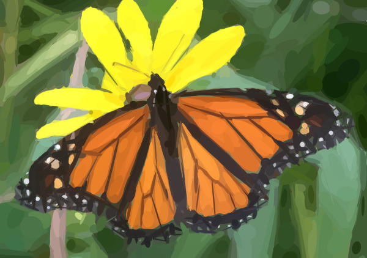

# Yum or Yuck 2022 Butterfly Mimics

## A Kaggle Community Competition

This project contains the documents for the *Yum or Yuck 
2022 Butterfly Mimics* competition. The dataset is not
included here but can be downloaded separately, see below. 

The competition is hosted by Kaggle at,
https://www.kaggle.com/c/yum-or-yuck-butterfly-mimics-2022

## Kaggle Overview Page

- [Description](kaggle-overview-description.md)
- [The Butterflies](kaggle-overview-thebutterflies.md)
- [Getting Started](kaggle-overview-gettingstarted.md)
- [Evaluation](kaggle-overview-evaluation.md)
- [Timeline](kaggle-overview-timeline.md)

## The Dataset

The Butterfly Mimics Dataset can be found at,
https://www.kaggle.com/datasets/keithpinson/butterfly-mimics-2022

## License

[MIT](./LICENSE)

Dataset licensed separately.