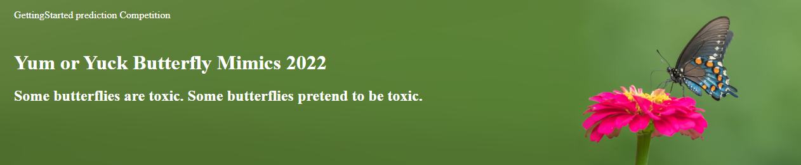
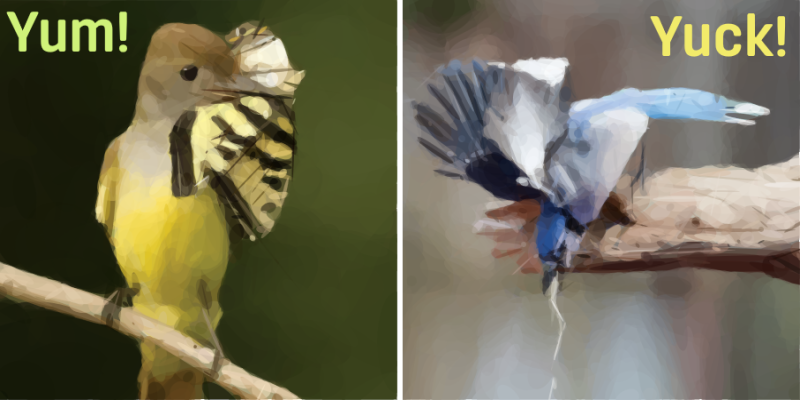
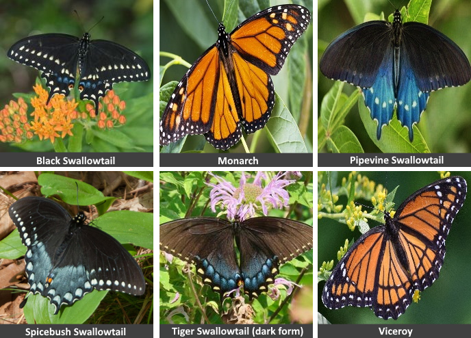

http://www.kaggle.com/c/yoy-mimics-2022

In the butterfly world caterpillars feed on a single type of plant, known as their host plant. A butterfly will lay eggs on this plant. An egg will hatch and the caterpillar will eat this plant. In its chrysalis the butterfly will transform and emerge as a glorious, flying adult. And the cycle will continue when it mates and eggs are laid again. 

It would be a beautiful story, but it is not. The butterfly is fighting for its life. From caterpillar to winged adult, the butterfly must avoid becoming some predator's meal. Fortunately for the butterfly, it has some tricks to help keep it alive.

Some host plants, milkweed and pipevine for example, contain toxins. The caterpillars sequester these toxins in their system and well in to adulthood they are yucky tasting for birds. Other caterpillars eat non-toxic plants and taste yummy to birds. But the yummy tasting butterflies use a disguise. They have changed their colors and patterning to look like the yucky butterflies. This mimicry is so effective that many butterfly species mimic the one toxic species. Birds can't tell the difference and avoid eating all of them.

## The Objective

Craft a deep learning model that is better than a bird and place in the top three spots (ties accepted).

A better than a bird classifier could identify all the yummy butterflies as *yummy* and "eat" them without regard to perfectly classifying each butterfly, that is to say, yummy butterflies could be confused with yummy and still be better than a bird. 

For this competition, we are going to disregard the binary classification and focus solely on the problem of classifying the 6 species of butterflies. With that in mind, the metric used to measure your place in the competition is the ***F1 Score*** of your butterfly classifier.

### The  Butterflies

| Name      | Common Name               | Species      | Note                         |
| --------- | ------------------------- | ------------------- | ---------------------------- |
| black     | Black Swallowtail         | Papilio polyxenes | mimics Pipevine             |
| monarch   | Monarch                   | Danaus plexippus | sequester cardiac glycoside toxins |
| pipevine  | Pipevine Swallowtail      | Battus philenor | sequester aristolochic acid |
| spicebush | Spicebush Swallowtail     | Papilio troilus | mimics Pipevine              |
| tiger     | Eastern Tiger Swallowtail | Papilio glaucus | females may mimic Pipevine |
| viceroy   | Viceroy                   | Limenitis archippus | mimics Monarch, sequester salicylic acid  |

## Why this is important?

While identifying yummy and yucky butterflies is done all in good fun, the underlying need for butterfly classification is seriously important. On 22 July 2022, the Monarch butterfly was declared endangered by the International Union for Conservation of Nature (IUCN). The Spicebush Swallowtail is considered threatened.

Butterflies, birds, and many other animals can benefit from trustworthy population surveys. Artificial neural networks are remarkably good at classifying many species of animals. Models like developed in this competition, coupled with the right equipment, and with a lot of other work, can help us keep tabs on butterfly populations and help to preserve their numbers in our changing world.
