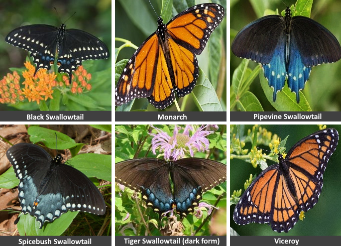

http://www.kaggle.com/c/yoy-mimics-2022

In the butterfly world caterpillars feed on a single type of plant, known as their host plant. A butterfly will lay eggs on this plant. An egg will hatch and the caterpillar will eat this plant. In its chrysalis the butterfly will transform and emerge as a glorious, flying adult. And the cycle will continue when it mates and eggs are laid again. 

It would be a beautiful story, but it is not. The butterfly is fighting for its life. From caterpillar to winged adult, the butterfly must avoid becoming some predator's meal. Fortunately for the butterfly, it has some tricks to help keep alive.

Some host plants, milkweed and pipevine for example, contain toxins. The caterpillars sequester these toxins in their system and well in to adulthood they are yucky tasting for birds. Other caterpillars eat non-toxic plants and taste yummy to birds. But the yummy tasting butterflies use a trick. They have changed their colors and patterning to look like the yucky butterflies. This mimicking is so effective that for a single yucky butterfly species there are many mimics. Birds can't tell the difference and don't eat any of them.

## The Objective

Craft a deep learning model that is better than a bird at classifying 6 common North American butterflies and place in the top 3 amongst your fellow competitors.

### The  Butterflies

| Name      | Common Name               | Species             | Note                         |
| --------- | ------------------------- | ------------------- | ---------------------------- |
| black     | Black Swallowtail         | Papilio polyxenes   | mimics Pipevine             |
| monarch   | Monarch                   | Danaus plexippus    | sequester cardiac glycoside toxins |
| pipevine  | Pipevine Swallowtail      | Battus philenor     | sequester aristolochic acid |
| spicebush | Spicebush Swallowtail     | Papilio troilus     | mimics Pipevine              |
| tiger     | Eastern Tiger Swallowtail | Papilio glaucus     | females may mimic Pipevine |
| viceroy   | Viceroy                   | Limenitis archippus | mimics Monarch, sequester salicylic acid  |

---

Copyright © 2022 Keith Pinson
