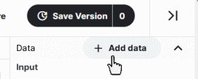

http://www.kaggle.com/c/yoy-mimics-2022

# Yum or Yuck Butterfly Mimics 2022

## Getting Started

# Getting Started with this Competition

This page we will briefly tell you how to:

1. Create a notebook and attach the dataset
2. Build a dataset pipeline
3. Build your model
4. Evaluate your results
5. Submit your predictions

---

Please take a peak at the following notebooks for working examples of working code:

- [butterfly-mimics-2022-exploration](https://www.kaggle.com/code/keithpinson/butterfly-mimics-2022-exploration)
- [yoy-mimics-2022-baseline](https://www.kaggle.com/code/keithpinson/yoy-mimics-2022-baseline)

The notebooks and the helps in this page mostly use TensorFlow.

---

# 1. Create a notebook and attach the dataset

If you are new to Kaggle you can get started by:

A)   clicking  

B)   and then **< > New Notebook**

Attach the *Dataset of Butterfly Mimics* by taping "Add data":

C)    

D)   Type "Butterfly Mimics" 
        in the search window     

E)   Click "Add" on the *2022 Dataset of Butterfly Mimics* banner


---


# 2. Build a dataset pipeline

Although the dataset used in this competition is small, it is good practice to use tools that are optimized to run CPU and GPU tasks with minimal bottlenecking. In TensorFlow we want to use Dataset. The following tips may help:

## A. Use AUTOTUNE

Set 

```Python
AUTOTUNE = tf.data.experimental.AUTOTUNE
```

and use it where it is allowed, for example `num_parallel_calls=AUTOTUNE`.

## B. Use TensorFlow Dataset

Make your Dataset  with **`from_tensor_slices()`** and then use **`map()`** to load the feature matrix. The function that does the mapping call to **tf.numpy_function()**, this function is the secret to boosting the performance during training.  It will be something like,

```python
import tensorflow as tf

images_ds = tf.data.Dataset.from_tensor_slices(images_df)
images_ds = images_ds.map(get_feature_and_label)
	⋮
features_labels = tf.numpy_function(load_jpg,[x,y],[tf.float32,tf.float32,tf.string])
	⋮
```

Doing this will allow Tensorflow to prefetch batches and run things optimally using the CPU.

Since in the "2022 Butterfly Mimics" dataset all the butterfly photos for training are stored in one folder, `/images,` and all the testing photos stored in another, `/image_holdouts,` we load the csv files first to get the photo filenames and then load the photos.

# 3. Build your model

The "baseline" notebook makes the following calls. 

```python
import tensorflow as tf

butterfly_model = tf.keras.Model(inputs, outputs, name=MODEL_NAME)
	⋮
    
butterfly_model.compile(
    optimizer=tf.keras.optimizers.Adam(learning_rate=LEARNING_RATE),
    loss=tf.keras.losses.categorical_crossentropy,
    metrics=['accuracy']
)
	⋮
   
fit_history = butterfly_model.fit(
    train_ds,
    shuffle=True,
    epochs=EPOCHS,
    callbacks=[stop_early],
    validation_data=validate_ds,
    verbose=1
)

```

Tweaking the hyperparameters: LEARNING_RATE and EPOCHS is done for the calls made here.

This simple framework is deceptive in that it hides the layers and all the work that is being done between the inputs and outputs in the call to `tf.keras.Model()`.

Lets look at the inputs and outputs:

```
inputs = tf.keras.Input(shape=(IMAGE_HEIGHT, IMAGE_WIDTH, IMAGE_DEPTH))

x = inputs

	⋮

outputs = Dense(class_count, activation='softmax')(x)


butterfly_model = tf.keras.Model(inputs, outputs, name=MODEL_NAME)

```

There are many, many different ways to build the layers of the model as long as they start with a shape matching the image and finish with vector of 6 elements, one for each class of butterfly.

# 4. Evaluate your results

After your model is finished running, there are a number of things that we can do to see how it did.

## A. Plot the loss and accuracy 


## B. Call  predict

Using your validation data so that you have `y_truth` run `predict()` to get `y_pred`.

```python
y_pred = butterfly_model.predict()
```

## C. Check your  F1  score

```python
fbeta_score(y_truth, y_pred, beta=1, average='micro')

> F1 score: 0.
```


## D. Check the Classification Report

```python
classification_report(y_truth, y_pred)
```


## E. Plot the Confusion Matrix

The Confusion Matrix can be fancy or plain:

```python
confusion_matrix(y_truth, y_pred)
```


# 5. Submit your predictions

This is the final step. Run `predict()` on the test dataset.

```python
y_predictions = butterfly_model.predict(test_ds)
```

Zip the `y_predictions` with the *X*, image ids in a Pandas dataframe and you can use it to create the csv with:

```python
submit_df.to_csv("submission.csv", header=True, index=False)
```

 


---

Copyright © 2022 Keith Pinson
